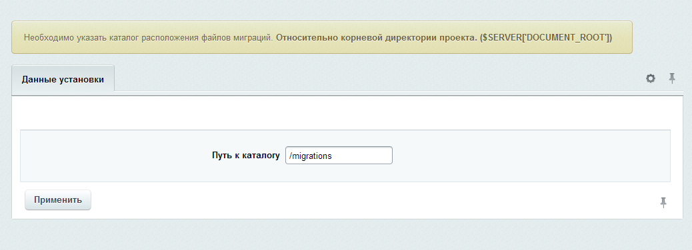
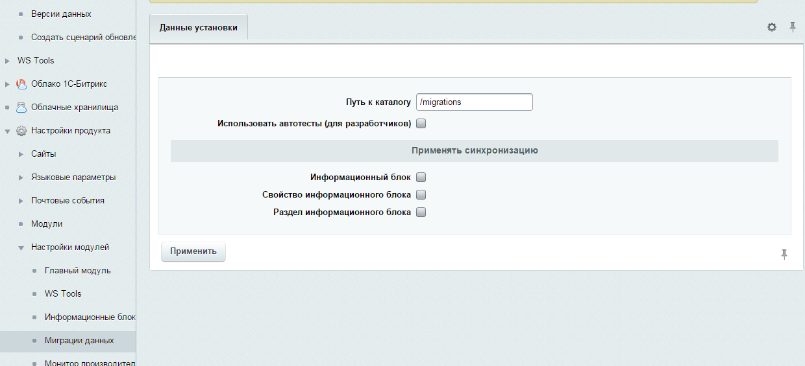
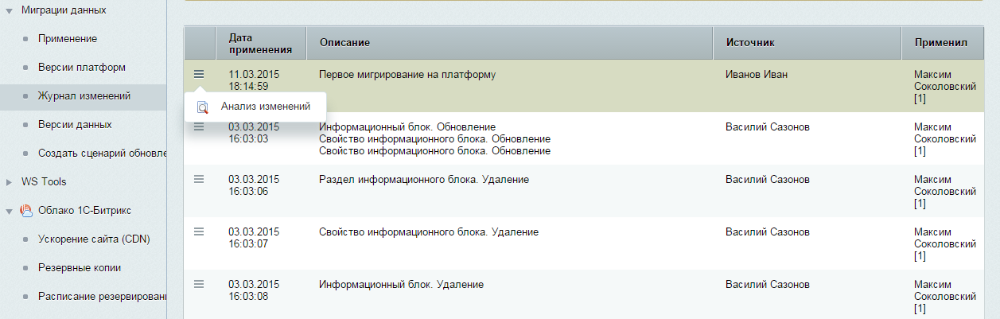
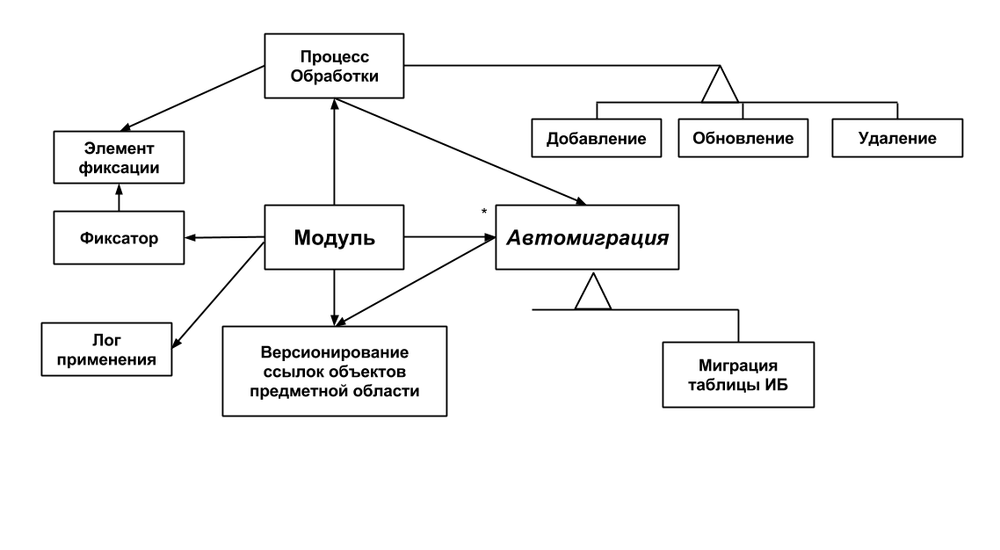

Модуль миграций
===============

### Установка и настройка

Для установки в адресную строку сайта, после доменного имени, прописать: 

```
/bitrix/admin/update_system_partner.php?addmodule=ws.migrations
```

При установке модуля необходимо определить основные параметры, на данный момент это путь к каталогу миграций.

###### Установка параметров при установке модуля

В этом каталоге будут создаваться файлы обмена данных.
Лучше всего каталог сделать версионируемым, в противном случае актуальность каталога необходимо будет обеспечивать в ручном режиме при помощи копирования фалов,
учитывая все версии проекта.



###### Настройка модуля

После установки модуля в настройках можно активировать учет изменений данных инфоблоков.
На текущий момент это: Информационный блок, Свойство информационного блока, Раздел информационного блока.
Если оставить эти обработчики неактивными автоматический учет изменения данных производится не будет.
Опцию `Использовать автотесты (для разработчиков)` необходимо оставить неактивной, она нужна
для включения тестирования модуля в мониторе качества и при прохождение тестов затрагивает структуру данных проекта.



Последним этапом настройки необходимо установить подпись текущей копии данных `Миграции данных -> Версии платформ`:


Поле текущая версия платформы отображает хэш уникальный среди остальных версий.
При помощи этого хэша происходит учет данных одинаковых сущностей и их разных идентификаторов. Модуль миграций учитывает соответствия версий и их идентификаторов. 

### Начало работы

Для старта успешного применения модуля миграций в проекте необходимо произвести инициализацию начального состояния,
состоит из следующих этапов:

1. В первую очередь нужно определить какая версия (копия или площадка) проекта является наиболее актуальной.
К примеру для проекта, который находится в разработке наиболее актуальной версией является одна из версий разработчиков, либо демонстрационная.
В проекте, которому обеспечивается техническая поддержка - наоборот, наиболее актуальной можно назвать `production` версию.

2. При помощи функцинала резервного копирования подготовить копию данных актуальной версии

[Подробнее про резервное копирование](http://dev.1c-bitrix.ru/learning/course/index.php?COURSE_ID=35&LESSON_ID=2031)

3. Обновить данные на другой площадке из созданной резервной копии при помощи скрипта [`restore.php`](http://www.1c-bitrix.ru/download/scripts/restore.php)

4. Очистить кэши на той площадке где была применена резервная копия.

5. **Обязательно сменить версию копии проекта.** Так как база данных была взята из соседней копии, версии проектов будут совпадать (уникальные хэши),
такое условие недопустимо для устойчивой работы `модуля миграций`. Необходимо сменить хэш и подпись копии данных для ее однозначной идентификации среди других
копий проекта. При нажатии на кнопку `Сменить` происходит обновление хэша текущей версии вместе с обновлением ссылок всех сущностей.
Установка владельца (подписи) производится тут же, но отдельным действием.


Теперь ваша площадка с `модулем миграций` полностью готова к работе.
Первоначальное выплнение вышеперечисленных действий в дальнейшем обеспичивает комфорт при разработки проектов.  
  
**Алгоритм учета изменений очень прост. Он состоит из следующих этапов:**

### Автоматический учет изменений (фиксация в файлы)

Учет изменений осуществляется при помощи обработки событий изменения предметной области,
события регистрируются для каждого обработчика модуля (например есть обработчик миграций разделов информационных блоков).
При этом обработчик, как правило, обрабатывает только один тип сущности. Обработчик, должен иметь три основных интерфейсных метода:

1. `getSnapshot` получение снимка данных для записи

2. `applySnapshot` примененеи в БД снимка данных для записи

3. `delete` удаление записи из БД 

При событии изменении данных вызываются определенные методы обработчика для создания нового снимка схемы данных,
который помещается во вновь созданную фиксацию и сохраняется в файл (формат json).

### Применение изменений

Применение изменений осуществляется путем анализа файлов фиксаций,
вычисляются новые файловые фиксации (которые небыли исполнены для текущей копии проекта),
данные фиксаций передаются обработчикам для обновления. Т.о. получается что обработчик который делал снимок, он же этот снимок и востанавливает на текущей БД.

```
При работе с несколькими версиями и созданием новых записей возникает проблема "одновременного" создания новой записи и рассинхронизация модели данных. 
Поэтому при создании новых записей данных сторонних версий создаются фиксации учета ссылок текущей версии,
которые так же необходимо экспортировать синхронизировть файлы каталога миграций. 
```

###### Основной интерфейс применения миграций.


###### Интерфейс применения миграций. Просмотр перечня изменений.


###### Подробная информация для анализа изменения


### Откат изменений

Любые изменения фиксаций журналируются. Сохраняются как новые данные, так и снимок созданный перед применением миграций.
Таким образом существует возможность отката последнего обновления. Так же стоит отметить,
что обновления устанавливаются пакетами и при применении обновлений сохраняется запись о пользователе установившем обновления и времени обновления.

### Работа со скриптами миграций

Если стандартного функционала не хватает для поддержки версий (копий) проекта в актуальном состоянии `модуль миграций` предоставляет
функционал создания "гибкой миграции" путем определения сценария миграции программистом. 

#### 1. Создание скрипта

Создание класса сценария осуществляется из меню `Миграции данных -> Создать сценарий обновления`,
где необходимо ввести название сценария и описание

###### Создание сценария. Ввод названия


При применение появляется сообщение с информацией о местонахождении файла класса

###### Создание сценария. Применение


#### 2. Редактирование. Определение агоритма исполнения скрипта

По пути описанному в сообщении находится следующий класс

###### Сценарий. Редактирование класса


В нем предназначены для модификации два метода:
* `commit` - содержит алгоритм применения миграции
* `rollback` - содержит алгоритм отката миграции

Методы `getData` и `setData` предоставляют доступ к данным и их сохранение соответственно, необходимо для сохранения данных для отката.

В случае, если скрипты миграций работают в тандеме с автоматическими миграциями классу сценария предоставлен доступ к контролеру ссылок `$this->getReferenceController()` для
регистрации или получения идентификаторов записей согласно версиям копий проекта, он необходим для работы с сущностями которые также затрагиваются автомиграциями.

#### 3. Применение

Применение сценариев миграций осуществляется через функционал общего применения.

###### Применение сценариев миграций


Данные по сценариям миграций так же попадают в жарнал изменений. В анализе изменений можно просмотреть промежуточную информацию.

###### Журнал изменений



### Диаграммы работы модуля

  1. ###### Диаграмма классов

  

  2. ###### Диаграмма последовательности (фиксация изменений)

  .png)

  3. ###### Диаграмма последовательности (применение изменений)

  .png)

  4. ###### Версионирование. Принцип определения версий

  

