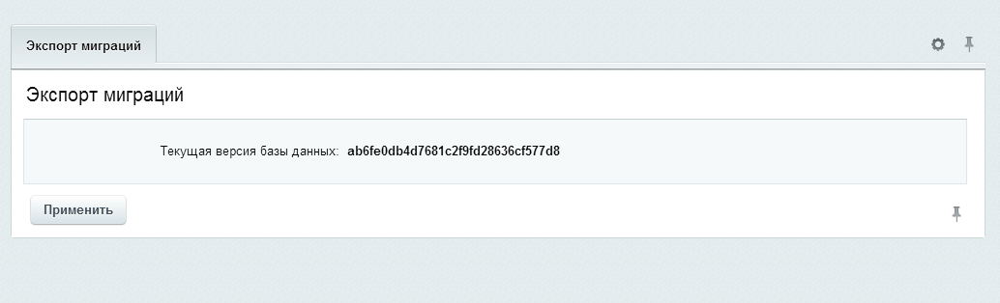
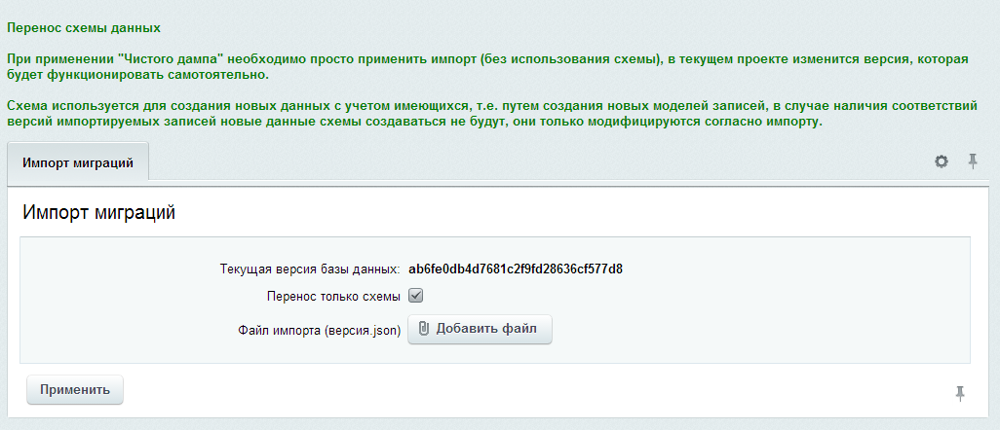
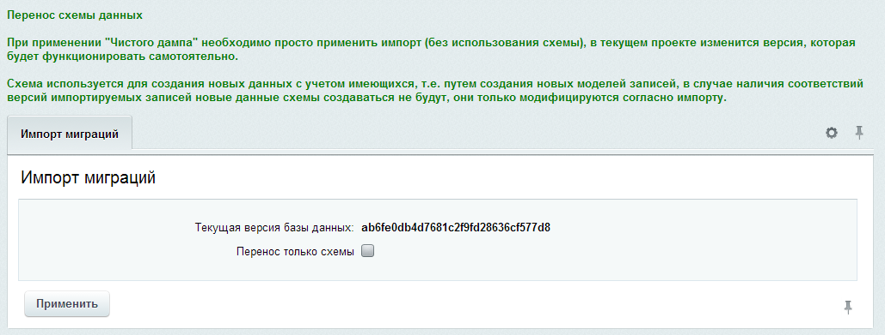
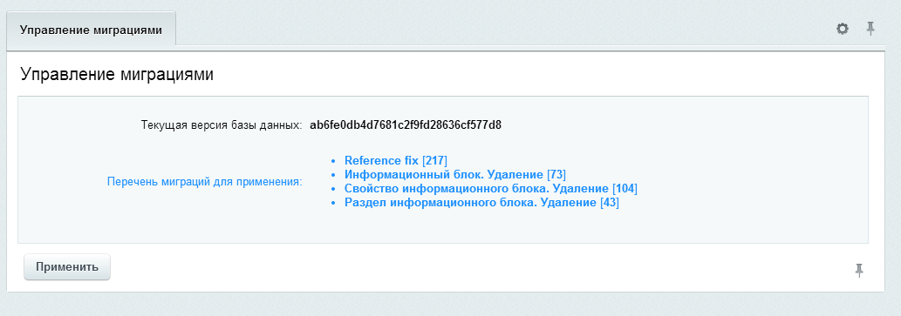

Модуль миграций
===============

### Установка и настройка

Для установки в адресную строку сайта добавить: 

```
/bitrix/admin/update_system_partner.php?addmodule=ws.migrations
```

При установке модуля необходимо определить основные параметры, такие как: путь к каталогу миграций. В этом каталоге будут создаваться файлы для поддержки (импорта/экспорта) актуализации схемы данных. Лучше всего каталог сделать версионируемым, в противном случае актуальность каталога необходимо будет обеспечивать в ручном режиме при помощи копирования фалов, учитывая все версии проекта.

###### Установка параметров при установке модуля


В процессе установки создаются ссылки по всем записям мигрирующих сущностей.

После установки модуля в настройках можно активировать учет миграций разделов инфоблоков. Так как эта сущность не всегда нуждается в `мигрировании` по умолчанию она отключена.

###### Настройка модуля


Активирование тестов в настройках необходимо только при работе над реализацией функционала непосредственно модуля, активирование этого флага непосредственно в проекте может привести к непредсказуемым результатам.

### Начало работы

Для начала успешного применения модуля миграций в проекте необходимо произвести инициализацию начального состояния. В первую очередь нужно определить какая версия проекта является наиболее актуальной. К примеру для проекта, который находится в разработке наиболее актуальной версией является одна из версий разработчиков, либо демонстрационная. В проекте, которому обеспечивается техническая поддержка - наоборот, наиболее актуальной можно назвать `production` версию. 

##### Способы инициализации в зависимости от приведенных выше ситуаций:

  1. ##### Импорт схемы данных.
  
  Использовать в случае развертывания на `production` сервере разработанного проекта. Необходимо произвести экспорт миграций актуальной версии разработчика на странице управления модулем `Экспорт миграций`. 
  
  ###### Экспорт схемы миграций

  

  Полученную схему загрузить на `production` версию проекта на странице импорт миграций. Обязательно указать флаг “Перенос только схемы” и загрузить файл с актуальной схемой. При этом должны создаться необходимые инфоблоки проекта, со списком ссылок.
  
  ###### Импорт схемы данных миграций
  
  

  2. ##### Использования дампа данных проекта. 
  
  Даже при наличии данных у разработчиков, при подключении модуля миграций, рекомендуется использовать именно этот способ, т.к. является наиболее стабильным решением. Для этого необходимо сделать дамп данных проекта используя стандартные инструменты Битрикс (у источника дампа данных должен быть активирован модуль миграций) и применить его на версии разработчика. Важно: Сразу после применения дампа необходимо на странице импорта миграций активировать текущую версию, нажав для этого кнопку `Применить` (флаг `Перенос только схемы` должен быть 
  неактивен). 

  ###### Произведение импорта в момент следующий за обновлением дампа данных.

  
  
  ###### Что происходит в этом случае? 
  
  В этом случае происходит обновление хэша текущей версии вместе с обновлением ссылок всех сущностей.
  
### Как происходит учет изменений (фиксации в файлы)

Учет изменений осуществляется при помощи обработки событий изменения предметной области, события регистрируются для каждого обработчика модуля (например есть обработчик миграций разделов информационных блоков). При этом обработчик обрабатывает только один тип сущности.

При событии изменении данных вызываются определенные методы обработчика для создания нового снимка схемы данных, который помещается во вновь созданную фиксацию и сохраняется в файл (формат json).
  
### Применение изменений

Применение изменений осуществляется при анализе файлов фиксаций, вычисляются новые фиксации, извлекаются их данные и при помощи обработчиков которые сохраняли эти данные для фиксаций эти данные обновляют текущую схему. Важно понимать, что при создании новых сущностей сторонних версий создаются фиксации учета ссылок текущей версии, которые так же необходимо экспортировать синхронизировть файлы каталога миграций). 

###### Интерфейс применения миграций, т.е. изменений основанных на парралельных версиях проекта.



Для более глубокого понимания применения изменений с учетом версионирования есть схема.

### Откат изменений

Любые изменения фиксаций журналируются. Сохраняются как новые данные, так и снимок созданный перед применением миграций. Таким образом существует возможность отката последнего обновления. Так же стоит отметить, что обновления устанавливаются пакетами и при применении обновлений сохраняется запись о пользователе установившем обновления и времени обновления.

### Диаграммы работы модуля

  1. ###### Диаграмма классов

  

  2. ###### Диаграмма последовательности (фиксация изменений)

  .png)

  3. ###### Диаграмма последовательности (применение изменений)

  .png)

  4. ###### Версионирование. Принцип определения версий

  

